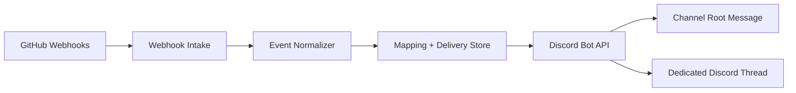

# Octothread

Turn noisy GitHub activity into focused Discord discussions.

Octothread is a GitHub issues and pull requests to Discord threads bridge. It creates one Discord thread per issue or pull request and keeps follow-up activity routed there, so your main channel stays readable while every work item gets its own place to breathe.

Status: Public MVP in progress

## The Problem

Most GitHub to Discord integrations dump every event into a single channel:

- issue opened
- PR opened
- comments
- reviews
- state changes

That works for basic visibility, but it breaks down fast. Important work gets buried, parallel conversations collide, and the channel becomes a log stream instead of a workspace.

## The Fix

Octothread turns a Discord channel into an index and each issue or pull request into its own discussion room.

- One root message per GitHub issue or pull request
- One dedicated Discord thread per work item
- Follow-up events routed into the existing thread
- Delivery deduplication for GitHub webhook retries
- Bot-loop protection to avoid self-amplifying noise

## How It Works



High-level flow:

1. GitHub sends a webhook event.
2. Octothread validates the delivery and normalizes it into an issue or pull request entity.
3. If the entity is new, Octothread creates a root channel message and a Discord thread.
4. If the entity already exists, Octothread posts the update into the existing thread.
5. Delivery IDs are stored to prevent duplicates when GitHub retries the same event.

## Public MVP Scope

The first public release focuses on the core bridge:

- Create a Discord thread for each opened GitHub issue
- Create a Discord thread for each opened GitHub pull request
- Route follow-up activity into the matching thread
- Reflect lifecycle changes such as close and reopen
- Keep the main channel readable instead of noisy

Supported GitHub event families for the MVP:

| Event family | Purpose |
| --- | --- |
| `issues` | Create and update issue threads |
| `issue_comment` | Route issue discussion into the matching thread |
| `pull_request` | Create and update pull request threads |
| `pull_request_review` | Route review summaries into the matching thread |
| `pull_request_review_comment` | Route inline review comments into the matching thread |
| `pull_request_review_thread` | Reflect review thread activity in the matching thread |

## Core Concepts

Octothread is intentionally small. The MVP is centered around four internal concepts:

- `EntityKey`: stable key for a GitHub work item, such as `owner/repo + issue_or_pr + number`
- `ThreadMapping`: the persisted link between a GitHub entity and a Discord thread
- `DeliveryRecord`: stored GitHub delivery ID used for deduplication
- `RepoConfig`: per-repository runtime configuration for GitHub and Discord routing

## Quick Start

The runtime bootstrap is currently being built. This repository already locks the MVP contract and configuration surface so early adopters can prepare the integration path.

Target local setup:

```bash
git clone git@github.com:atls/octothread.git
cd octothread

export GITHUB_WEBHOOK_SECRET=your-webhook-secret
export DISCORD_BOT_TOKEN=your-discord-bot-token
export DISCORD_CHANNEL_ID=your-discord-channel-id
export PORT=3000
```

What you need on day one:

1. A GitHub webhook pointing to your Octothread server
2. A Discord bot with permission to post messages and create threads in the target channel
3. A persistent store for thread mappings and processed delivery IDs

## Configuration

The MVP keeps the configuration surface intentionally small:

| Variable | Required | Purpose |
| --- | --- | --- |
| `GITHUB_WEBHOOK_SECRET` | Yes | Validates incoming GitHub webhook deliveries |
| `DISCORD_BOT_TOKEN` | Yes | Authenticates Octothread against the Discord Bot API |
| `DISCORD_CHANNEL_ID` | Yes | Root Discord channel used as the thread index |
| `PORT` | Yes | HTTP port for webhook intake and health endpoints |

## Why Not Plain GitHub to Discord Webhooks?

Because plain webhook forwarding is a notification stream, not a work router.

Octothread exists for teams that want:

- a thread per issue or PR
- a stable place for discussion history
- less channel spam
- cleaner handoff between code and chat

## Roadmap

- [x] Public repository and product positioning
- [x] Planning milestone and delivery structure
- [ ] Runtime bootstrap and webhook intake
- [ ] Thread mapping and delivery deduplication
- [ ] Issue and pull request thread lifecycle
- [ ] Polished local development experience

## Contributing

Octothread is being built in the open.

If this problem matches your workflow, open an issue with:

- your GitHub event mix
- your Discord channel setup
- the failure mode you want to eliminate

The project is optimized for the focused bridge use case first: GitHub issues and pull requests to Discord threads.

## License

BSD-3-Clause. See [LICENSE](./LICENSE).
